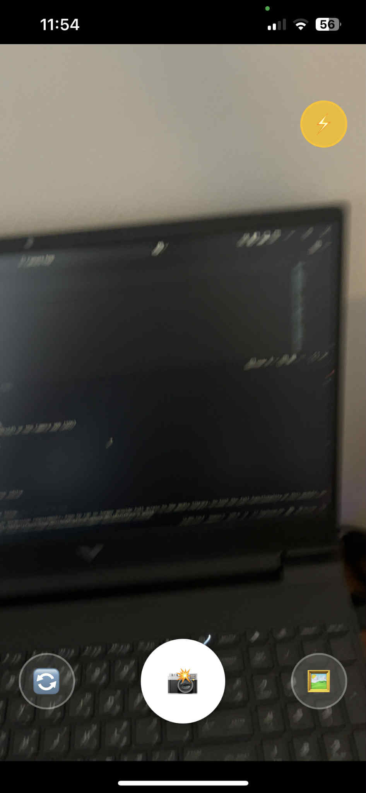
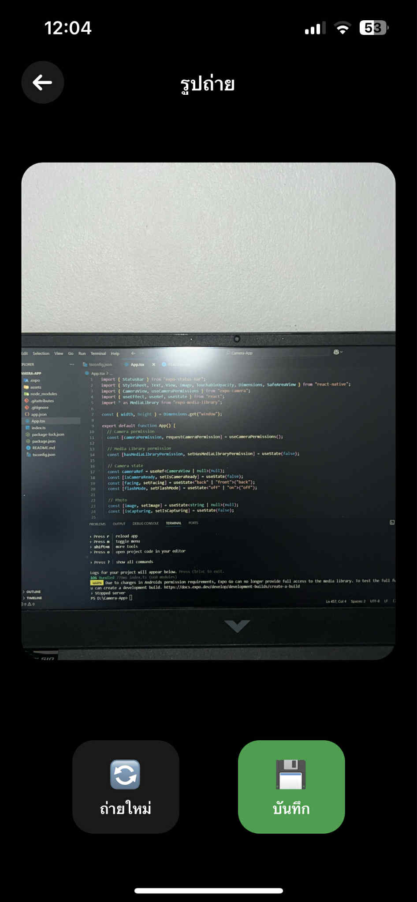
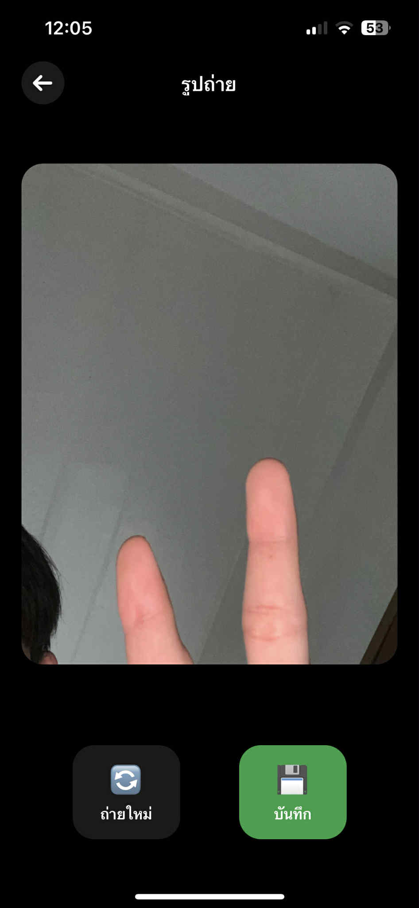
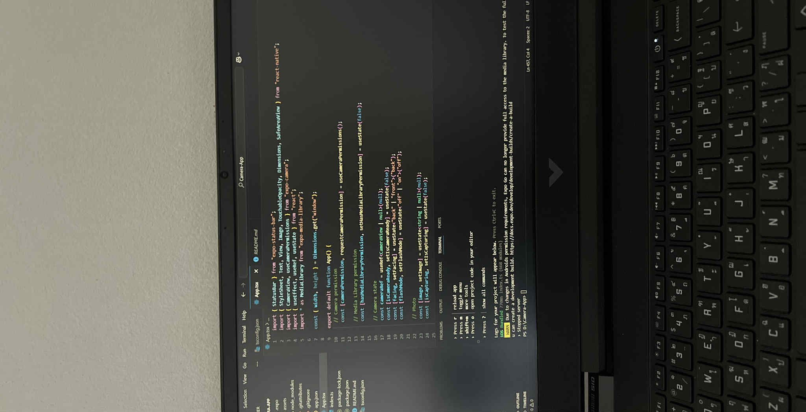

# 📸 Enhanced Camera App

แอปกล้องถ่ายรูปที่สวยงามและใช้งานง่าย สร้างด้วย React Native และ Expo Camera

## ✨ Features

### 🎯 ฟีเจอร์หลัก
- **📷 ถ่ายรูปคุณภาพ HD** - คุณภาพสูงสุด (Quality: 1.0)
- **🔄 สลับกล้อง** - เปลี่ยนระหว่างกล้องหน้าและกล้องหลัง
- **⚡ ไฟแฟลช** - เปิด/ปิดไฟแฟลชสำหรับถ่ายรูปในที่มืด
- **💾 บันทึกรูป** - บันทึกรูปลงในอัลบั้มของเครื่องอัตโนมัติ
- **🖼️ ดูตัวอย่างรูป** - ดูรูปที่ถ่ายก่อนบันทึกหรือถ่ายใหม่

### 🎨 UI/UX ที่โดดเด่น
- **Dark Theme** - ธีมสีดำที่ดูโปรเฟสชั่นนัล
- **Glassmorphism Effects** - เอฟเฟกต์แก้วที่ทันสมัย
- **Intuitive Controls** - ปุ่มควบคุมที่ใช้งานง่าย
- **Responsive Design** - รองรับทุกขนาดหน้าจอ
- **Safe Area Support** - รองรับ iPhone notch และ Android

## 🚀 การติดตั้ง

### ข้อกำหนดระบบ
- Node.js 16+ 
- Expo CLI
- iOS Simulator หรือ Android Emulator
- หรือ Expo Go App บนมือถือ

### ขั้นตอนการติดตั้ง

1. **Clone โปรเจค**
```bash
cd camera-app
```

2. **ติดตั้ง Dependencies**
```bash
npm install
# หรือ
yarn install
```

3. **รันแอป**
```bash
npx expo start
```

4. **เลือกแพลตฟอร์ม**
- กด `i` สำหรับ iOS Simulator
- กด `a` สำหรับ Android Emulator  
- สแกน QR Code ด้วย Expo Go App

## 📦 Dependencies

### หลัก
- `expo` - Expo framework
- `react-native` - React Native core
- `expo-camera` - Camera functionality
- `expo-media-library` - Save photos to gallery

### UI Components
- `expo-status-bar` - Status bar control
- `react-native` components (View, Text, TouchableOpacity, etc.)

## 🎮 วิธีใช้งาน

### หน้าจอกล้อง
1. **ปุ่มสลับกล้อง** (ซ้าย) - เปลี่ยนระหว่างกล้องหน้า/หลัง
2. **ปุ่มถ่ายรูป** (กลาง) - กดเพื่อถ่ายรูป
3. **ปุ่มแฟลช** (ขวา) - เปิด/ปิดไฟแฟลช

### หน้าจอดูตัวอย่าง
1. **ปุ่มกลับ** (← บนซ้าย) - กลับไปหน้าจอกล้อง
2. **ปุ่มถ่ายใหม่** (🔄) - ถ่ายรูปใหม่
3. **ปุ่มบันทึก** (💾) - บันทึกรูปลงอัลบั้ม


## 🎯 State Management

### Camera States
```javascript
const [isCameraReady, setIsCameraReady] = useState(false);
const [facing, setFacing] = useState("back");
const [flashMode, setFlashMode] = useState("off");
const [image, setImage] = useState(null);
const [isCapturing, setIsCapturing] = useState(false);
```

### Permission States
```javascript
const [cameraPermission, requestCameraPermission] = useCameraPermissions();
const [hasMediaLibraryPermission, setHasMediaLibraryPermission] = useState(false);
```

## 🚀 การ Deploy

### Expo Build
```bash
# สร้าง build สำหรับ Android
npx expo build:android

# สร้าง build สำหรับ iOS  
npx expo build:ios
```

### EAS Build (แนะนำ)
```bash
# ติดตั้ง EAS CLI
npm install -g @expo/eas-cli

# Build
eas build --platform android
eas build --platform ios
```


## แสดงผลลัพธ์หน้าจอ
## 📱 แสดงผลลัพธ์หน้าจอ

### หน้าจอกล้อง


### หน้าจอตัวอย่างรูป


### ปุ่มควบคุม


### การบันทึกลงอัลบั้ม


### ตัวอย่างรูปถ่าย


**Happy Coding! 📸✨**